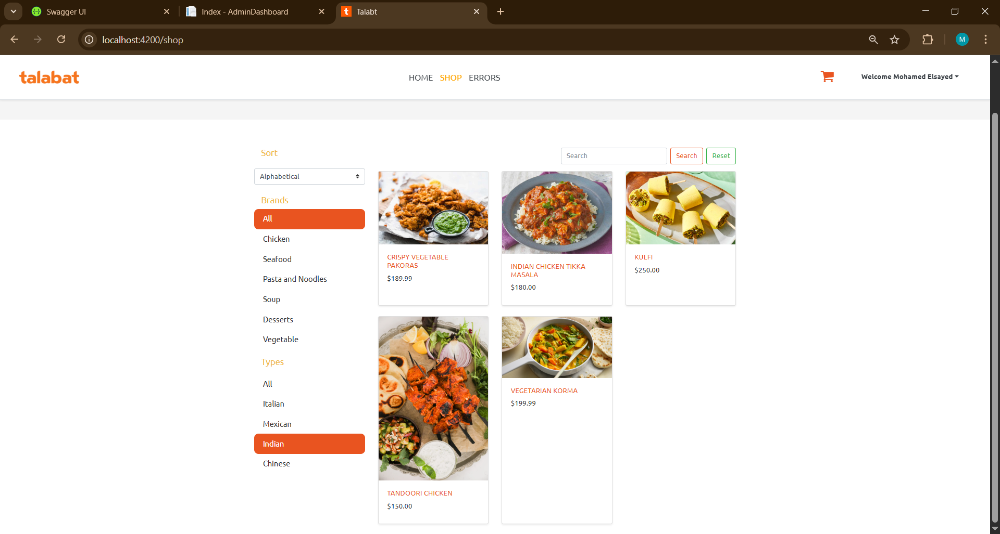
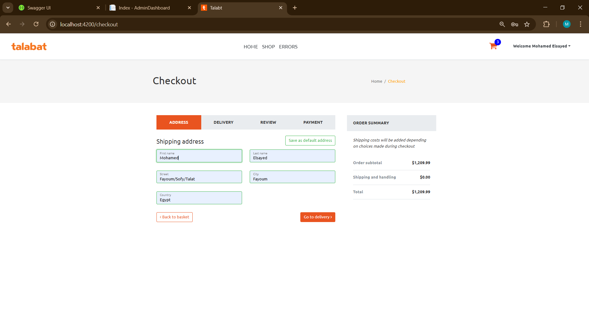
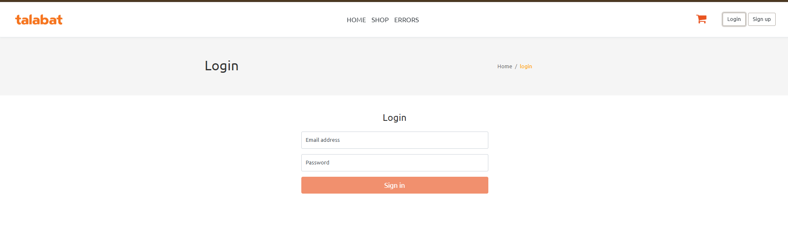
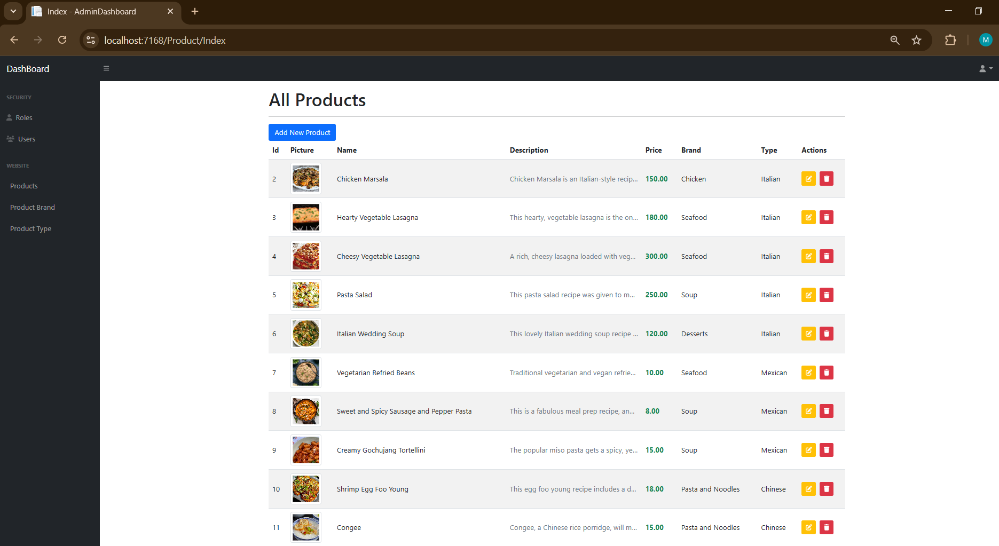
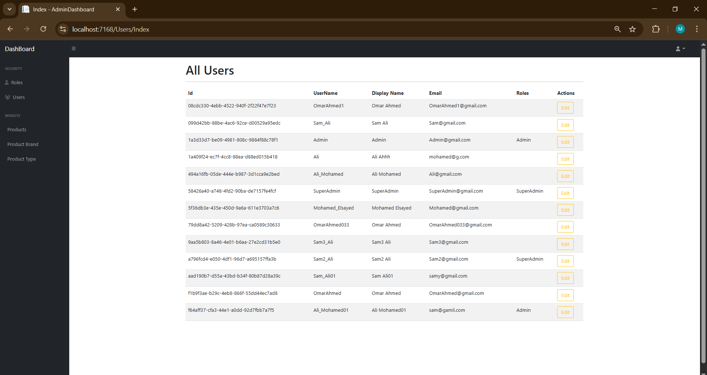
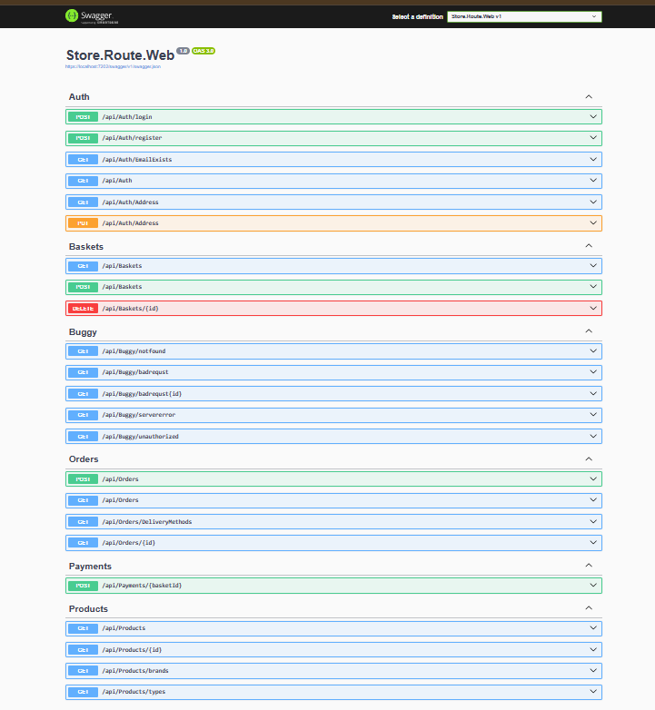

# 🛒 TechWise - Full-Stack E-Commerce Platform

A complete e-commerce solution built with **ASP.NET Core 8** (Onion Architecture) as the backend, **Angular** as the customer-facing frontend, and an **Admin Dashboard** powered by ASP.NET Core MVC.

---

## 📸 Project Screenshots

### Customer Frontend (Angular)
| Shop Page | Cart & Checkout |
|---|---|
|  |  |

| Authentication | Order Tracking |
|---|---|
|  |  |

### Admin Dashboard (ASP.NET Core MVC)
| Products Management | Users & Roles |
|---|---|
|  |  |

### API Documentation
| Swagger UI |
|---|
|  |

---

## 🏗️ Architecture

This project follows **Onion (Clean) Architecture** with full separation of concerns:

```
Store.Route/
├── 📁 Core/
│   ├── Store.Route.Domains/              # Entities, Interfaces, Exceptions
│   ├── Store.Route.Services.Abstractions/ # Service Interfaces, DTOs Contracts
│   └── Store.Route.Services/             # Business Logic, Specifications, Mapping
│
├── 📁 Infrastructure/
│   ├── Store.Route.Persistence/          # Data Access, Repositories, DbContext
│   └── Store.Route.Presentation/         # API Controllers
│
├── 📁 AdminDashBoard/                    # Admin Panel (MVC - Cookie Auth)
├── 📁 Store.Route.Web/                   # API Host + Middlewares + Configuration
├── 📁 Store.Route.Shared/                # Shared DTOs, Models, Constants
│
└── Store.Route.sln
```

### Architecture Flow

```
Client (Angular)  →  API Controllers  →  Services  →  Repositories  →  Database (SQL Server)
                          ↓                    ↓
                   JWT Authentication    Stripe Payment
                          ↓                    ↓
                     Redis Cache         Payment Intent

Admin (MVC)  →  Admin Controllers  →  Unit of Work  →  Repositories  →  Database (SQL Server)
                          ↓
                   Cookie Authentication
```

---

## 🛠️ Tech Stack

| Layer | Technology |
|---|---|
| **Backend API** | ASP.NET Core 8 Web API |
| **Admin Dashboard** | ASP.NET Core 8 MVC |
| **Frontend** | Angular 16+ (TypeScript, RxJS) |
| **Database** | SQL Server |
| **Caching** | Redis |
| **Payments** | Stripe (Elements API) |
| **Authentication** | ASP.NET Core Identity + JWT + Cookie Auth |
| **ORM** | Entity Framework Core 8 |
| **API Documentation** | Swagger / OpenAPI |
| **Mapping** | AutoMapper |
| **API Testing** | Postman |
| **Version Control** | Git + GitHub |

---

## ✨ Key Features

### 🛍️ Customer Features
- Browse products with filtering, sorting, and pagination
- Product search by name
- Shopping cart with real-time Redis caching
- Secure checkout with Stripe payment integration
- Order history and detailed order tracking
- User authentication (Register / Login / Logout)
- Address management

### 🔐 Authentication & Authorization
- **JWT Bearer Tokens** for the Angular SPA (stateless API auth)
- **Cookie Authentication** for the Admin Dashboard (server-side MVC auth)
- Role-based authorization (Admin / User roles)
- Password hashing with ASP.NET Core Identity

### 💳 Stripe Payment Integration
- Payment Intent creation on the backend
- Secure card input with Stripe Elements
- Test mode support (4242 4242 4242 4242)

### 📊 Admin Dashboard
- Full CRUD for **Products** (with image upload)
- Full CRUD for **Brands** and **Types**
- **User Management** - view users and assign roles
- **Role Management** - create, edit, delete roles
- Admin-only access with Cookie Authentication
- Duplicate name validation on create/edit

### 🏗️ Backend Design Patterns
- **Generic Repository Pattern** with Specifications
- **Unit of Work Pattern** for transaction management
- **Specification Pattern** for flexible query composition
- **Global Exception Handling Middleware**
- **Onion Architecture** with dependency injection
- **Data Seeding** for initial products, brands, types, and delivery methods
- **Two Authentication Schemes** running side by side (JWT + Cookie)

---

## 🚀 Getting Started

### Prerequisites
- .NET 8 SDK
- Angular CLI 16+
- SQL Server
- Redis Server
- Visual Studio 2022 / VS Code

### 1. Clone the Repository

```bash
git clone https://github.com/Mohamed012004/StoreApp.git
cd StoreApp
```

### 2. Database Setup

The database is configured with **automatic seeding**. Just update the connection strings:

Open `Store.Route.Web/appsettings.json` and set your connection strings:

```json
{
  "ConnectionStrings": {
    "DefaultConnection": "Server=.;Database=StoreApp;Trusted_Connection=True;TrustServerCertificate=True;MultipleActiveResultSets=True",
    "IdentityConnection": "Server=.;Database=StoreIdentity;Trusted_Connection=True;TrustServerCertificate=True;MultipleActiveResultSets=True",
    "RedisConnection": "localhost"
  }
}
```

> The database tables and seed data will be created automatically on first run.

### 3. Configure Secrets

Create or update `Store.Route.Web/appsettings.Development.json`:

```json
{
  "StripeOptions": {
    "SecretKey": "your_stripe_secret_key_here"
  }
}
```

### 4. Run the Backend API

```bash
cd Store.Route.Web
dotnet run
```

API available at: `https://localhost:7202/swagger`

### 5. Run the Admin Dashboard

Open a new terminal:

```bash
cd AdminDashBoard
dotnet run
```

Admin Dashboard available at: `https://localhost:7168`

### 6. Run the Angular Frontend

Open a new terminal:

```bash
cd TechWise
npm install
ng serve
```

Frontend available at: `https://localhost:4200`

---

## 🧪 API Testing

Import the Postman collection and test all endpoints:

| Category | Endpoints |
|---|---|
| **Auth** | Register, Login, Get Current User |
| **Products** | Get All (with pagination), Get By Id, Get Brands, Get Types |
| **Basket** | Get Basket, Update Basket, Delete Basket |
| **Orders** | Create Order, Get Orders, Get Order Details |
| **Payments** | Create Payment Intent, Update Payment Intent |

---

## 📁 Project Structure Details

### Domains Layer
- **Entities**: Product, ProductBrand, ProductType, Order, OrderItem, Basket, AppUser
- **Contracts**: IGenericRepository, IUnitOfWork, ISpecification, IBasketRepository
- **Exceptions**: NotFound, BadRequest, Unauthorized, Validation custom exceptions

### Services Layer
- **ProductService**: Product retrieval with specifications
- **BasketService**: Redis-based basket management
- **OrderService**: Order creation and tracking
- **PaymentService**: Stripe payment intent management
- **AuthService**: JWT token generation and user registration
- **Specifications**: ProductWithBrandAndType, Order, OrderWithPaymentIntent
